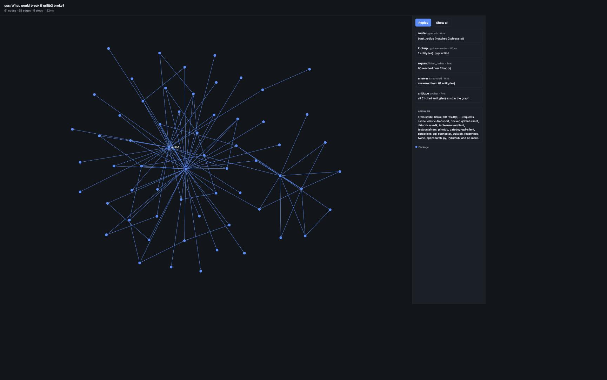
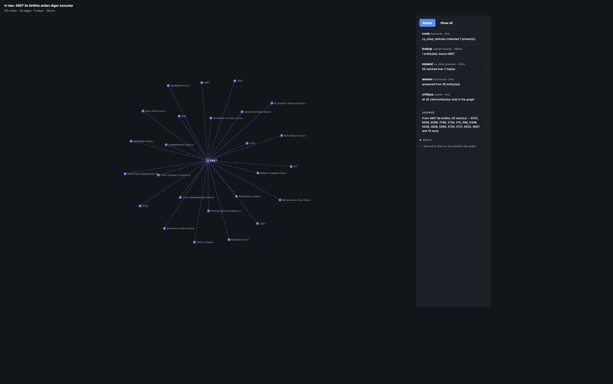

# GraphPack

Declarative domain packs on top of the
[flexible-graphrag](https://github.com/stevereiner/flexible-graphrag) engine.

A **pack** is a directory of configuration — an OWL ontology, some YAML, a CSV
of aliases — that turns a general GraphRAG pipeline into a specific vertical. No
Python. The engine repository is never modified; CI proves it.

The thesis under test: *adding a new vertical costs configuration, not code —
measured with precision/recall/F1 in domains that share almost nothing.*

| pack | domain | backbone | resolution | language |
|---|---|---|---|---|
| [`oss`](domains/oss/) | Python packaging | published metadata | exact | English |
| [`tr-law`](domains/tr-law/) | Turkish case law | built from citations in prose | fuzzy | Turkish |
| [`bench-wiki`](domains/bench-wiki/) | news, as a published benchmark | bibliographic metadata | fuzzy, on names | English |

The third one is where the claim gets a number. `bench-wiki` was added after the
other two were finished and measured, and it cost:

```
297 lines of configuration        9 files, no Python
  8 lines of GraphPack code       one new pack knob: extract: false
  0 lines of engine change        CI asserts the engine checkout is byte-identical
```

The eight lines are the honest part of the claim. A pack whose every edge comes
from a metadata field has nothing for a model to extract, and nothing in the
contract could say so — so the contract grew a knob. That is the shape the
thesis predicts a new vertical should have: configuration for the domain, and
occasionally one general capability the domain was the first to need.

**Status:** phases 0–6 and 8 complete; three packs live. `oss` corpus extraction
is running, and phase 7's benchmark numbers wait on it.

## Quickstart

Requires Python 3.12+, [uv](https://docs.astral.sh/uv/) and Docker.

```bash
git clone https://github.com/BurakkYuce/GraphPack.git
cd GraphPack

# The engine is a sibling checkout, pinned so results stay reproducible.
git clone https://github.com/stevereiner/flexible-graphrag.git ../flexible-graphrag
git -C ../flexible-graphrag checkout 71ce503837475c02cfcfb80cd882e3721fcbe1bc

uv venv --python 3.12
uv pip install -e ../flexible-graphrag/flexible-graphrag
uv pip install -e ".[dev]"

docker compose -f infra/compose.yaml up -d
uv run graphpack migrate
uv run graphpack packs validate

# Build the oss backbone: ~3 minutes of downloads, no credentials, no cost.
uv run graphpack backbone fetch oss
uv run graphpack backbone load oss
uv run graphpack backbone check oss
```

Always run from the repository root: the engine reads `.env` relative to the
working directory, and picking up its configuration by accident is a mistake
that only shows up as data in the wrong place.

## Commands

```
graphpack packs list                list packs
graphpack packs validate [PACK]     static checks — no services needed
graphpack packs schema PACK         compiled extraction schema
graphpack migrate [--dry-run]       apply pending migrations
graphpack migrate status            applied vs pending
graphpack pack register PACK        record version + ontology checksum
graphpack pack reset PACK           delete one pack's data, leave others alone
graphpack backbone fetch PACK       download the pack's structured sources
graphpack backbone load PACK        merge them into Neo4j (idempotent)
graphpack backbone check PACK       run the pack's sanity queries
graphpack ingest PACK [-n N]        run the corpus through the engine
graphpack inspect [PACK]            report what extraction wrote
graphpack resolve PACK              link mentions to canonical identifiers
graphpack validate-triples PACK     check relations against the ontology
graphpack ask PACK QUESTION         answer by walking the graph
graphpack ask-all PACK              run the pack's whole question set
graphpack viz PACK --id ID          write the run as a self-contained page
graphpack doctor                    check models and services are reachable
```

`graphpack packs schema oss` shows what the engine will actually extract with:

```
oss v0.1.0 — 6 entity types, 9 relation types, 7 entity props, 9 triple constraints

entities
  PACKAGE  (NAME)
  RELEASE  (VERSION)
  ...
relations
  DEPENDS_ON  PACKAGE -> PACKAGE
  MENTIONS_PACKAGE  ISSUE -> PACKAGE
  ...
```

## Layout

```
graphpack/          all Python — one package, because the engine occupies the
  packs/            top-level namespace (config, main, ingest, process, …)
  backbone/         structured data → Neo4j, no LLM
  migrations/       ordered, idempotent, tracked as (:_Migration) in the graph
  cli.py
domains/            packs — TTL, YAML, CSV, JSONL. No Python.
  oss/
infra/compose.yaml  Neo4j + Qdrant
docs/ENGINE.md      what GraphPack uses from the engine, and why
```

## The rules, and how they are enforced

| Rule | Check |
|---|---|
| Packs contain no Python | `test_domains_contain_no_python` |
| Code never imports `domains/` | `test_code_never_imports_domains` |
| No pack name appears in code | `test_no_pack_name_is_hard_coded_in_code` |
| Nothing shadows an engine module | `test_no_top_level_module_shadows_the_engine` |
| The engine checkout stays untouched | CI: `git status --porcelain` |
| Migrations apply from empty, in order, twice | CI: fresh-apply |

The third one is the thesis in a single assertion. It matches quoted names only,
so a pack called `oss` does not trip on "cross" or "across".

## Writing a pack

```
domains/<name>/
  pack.yaml         identity, extraction knobs, store targets   (required)
  ontology.ttl      OWL classes and object properties           (required)
  sources.yaml      structured sources → backbone               (required)
  checks.cypher     sanity queries, some of them assertions
  resolve.yaml      mention → canonical id rules                (phase 3)
  eval.yaml         gold generator selection                    (phase 4)
  retrieval.yaml    intent → Cypher template                    (phase 6)
```

`sources.yaml` says where records come from and what they become:

```yaml
normalize:
  slug: [lower, {regex_replace: {pattern: "[-_.]+", replace: "-"}}]

fetch:
  - id: packages
    url: "https://pypi.org/pypi/{project}/json"
    for_each: top-packages.jsonl     # one request per row
    keep: {name: info.name, requires_dist: info.requires_dist}

load:
  - source: packages.jsonl
    node: {label: Package, id: "pypi:{name|slug}"}
  - source: packages.jsonl
    explode: requires_dist           # one row per list element, as {value}
    edge: {type: DEPENDS_ON, from: "pypi:{name|slug}", to: "pypi:{value|slug}"}
```

Ids are templates, so the identifier scheme is a pack decision. `{a,b|slug}`
takes the first field that survives normalising. Uniqueness constraints are
derived from the labels a pack declares — no pack ships a migration.

A step may add `vote: true`, which holds its rows back and writes the value each
identity's mentions most agreed on:

```yaml
  - source: decisions.jsonl
    explode: {field: text, pattern: "(?P<statute>\\d{3,4})\\s*sayılı\\s+(?P<title>...)"}
    vote: true                       # the reading most decisions agree on
    node: {label: Statute, id: "kanun:{statute}", properties: {title: "{title}"}}
```

Use it where a property is recovered from repeated mentions rather than stated
once. MERGE is otherwise last-write-wins, so one bad reading at the end of the
corpus beats every good one before it: statute 6356's title was a sentence
fragment that happened to contain "4857 sayılı İş Kanun", which put another
statute's number into the text the resolver fuzzy-matches on. Ties go to the
earliest mention. Voting buffers the step's rows in memory, so it is opt-in.

The same file also says what becomes prose for the engine to extract from:

```yaml
derive:                              # JSONL to JSONL, no network
  - id: repos
    source: packages.jsonl
    explode: project_urls            # a mapping yields one row per entry
    fields: {slug: "{value|repo_slug}"}
    require: [slug]
    unique: slug

corpus:                              # rows to documents
  - source: issues.jsonl
    id: "gh:{slug}#{number}"
    text: "{title}\n\n{body}"
    metadata: {repo: "{slug}", url: "{url}"}
```

Every document is tagged with its pack. Extraction copies source metadata onto
the entities it produces, which is what makes an extracted entity attributable
in a database two packs share.

`resolve.yaml` joins the two halves — what the text said, and what the index
calls it:

```yaml
resolve:
  - entity: PACKAGE                  # extraction label
    target: Package                  # backbone label
    id: "pypi:{name|mention_name}"   # the candidate identifier
    match: "{name|mention_name}"     # what fuzzy compares, both sides
    methods: [exact, alias, fuzzy]   # most trustworthy first; first answer wins
    fuzzy_threshold: 93
    on_unresolved: provisional
```

The pass writes `(:__Entity__)-[:RESOLVED_AS {method, score}]->(:Package)` and
leaves the mention untouched, so a wrong conclusion stays reviewable. Changing a
rule and re-resolving takes seconds; re-extracting takes hours.

The **method breakdown** is the number that matters. A pack resolving 95% by
exact match and one resolving 95% by fuzzy match have the same headline and
completely different trustworthiness — and comparing those two distributions
across `oss` and `tr-law` is what the generality claim rests on.

## What the engine leaves undone

`validate-triples` applies the ontology's `rdfs:domain` and `rdfs:range` to what
extraction produced. The engine passes entity and relation *name lists* to the
extractor and nothing else, so those constraints govern nothing during
extraction: a relation can carry a declared type and still connect two things
the ontology never meant to pair. This is the only place they are checked.

## Models

Packs name no models. Set `LLM_PROVIDER` and `EMBEDDING_KIND` in `.env` — see
[docs/MODELS.md](docs/MODELS.md) and `.env.sample` — and `graphpack doctor` will
report what is active and whether it answers.

Local Ollama needs three adjustments the engine does not make, without which
extraction silently returns nothing. They are applied automatically and
explained, with measurements, in [docs/ENGINE.md](docs/ENGINE.md).

The ontology is read by the engine's OWL parser, which has opinions:

- classes need an explicit `a owl:Class`; `rdfs:Class` alone is invisible
- relations need `a owl:ObjectProperty` **plus** `rdfs:domain` and `rdfs:range`
- local names reach the extractor upper-cased (`Package` → `PACKAGE`)
- `default`, `none` and `sample` are reserved pack names

`graphpack packs validate` catches all of these before an ingest run does.

Note that `rdfs:domain`/`rdfs:range` do **not** constrain extraction: the engine
never forwards triple constraints to the extractor. GraphPack derives them and
enforces them in its own resolution pass. See
[docs/ENGINE.md](docs/ENGINE.md).

## Seeing a run

`graphpack viz` answers a question and writes the run as one HTML file — layout,
styling and data inlined, nothing fetched. It opens from disk.

```bash
uv run graphpack viz oss --id blast-urllib3 -o run.html
uv run graphpack viz tr-law --id cocited-4857 -o run.html
uv run graphpack viz oss "What would break if urllib3 broke?" -o run.html
```

`--id` reads the question from the pack's `questions.jsonl`, so a demo cannot
drift from the question the evaluation scores. Both pages below are committed
under [docs/demo/](docs/demo/) and open without a server.

**oss — what breaks if urllib3 breaks** ([page](docs/demo/oss-blast-radius.html))



Sixty packages over two hops. The subject keeps a ring and a label at every
step; the rest are labelled only when few enough to read.

**tr-law — statutes cited alongside 4857** ([page](docs/demo/tr-law-co-cited.html))



Every line here is **dashed**, which means the run derived the relation rather
than reading it. "Co-cited with 4857" is two `CITES` hops through a decision
that is not in the result, so nothing in the database joins these statutes
directly. Drawing them like stored edges would claim the graph holds something
it does not; drawing only stored edges left the answer as twenty-six
unconnected dots. A derived line is added only where the stored edges cannot
already connect the pair — which is why the oss picture, whose packages reach
each other through real dependency edges, has none.

Clicking a step lights what that step touched. `Replay` walks them in order.

## Testing

```bash
uv run pytest -m "not integration"   # no services required
uv run pytest                        # needs docker compose up
```

## License

MIT.
